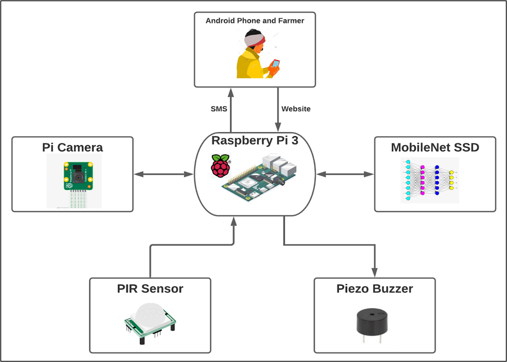
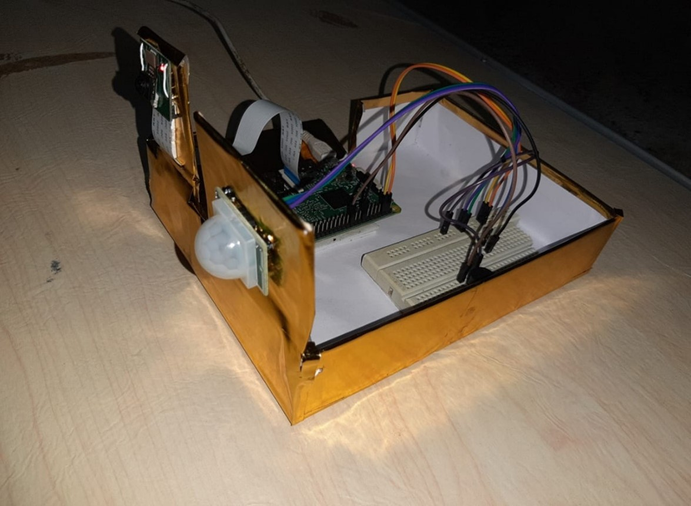
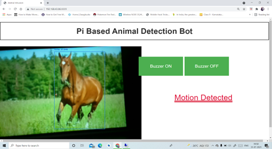
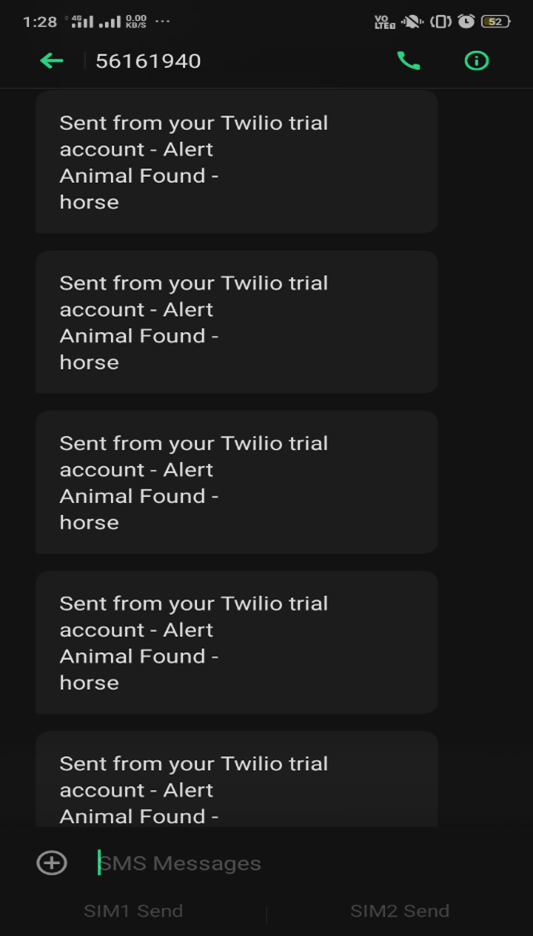

# IOT BASED SMART AGRICULTURE TO PROTECT CROP FROM ANIMAL INVASION

Animal attacks in India are a common story nowadays. Due to the unavailability of any detection these attacks kill villagers and also destroy their crops. Due to lack of proper safety measures, these villagers are left helpless to their fate. Therefore a proper detection could help save their lives and also to the preservation of crops. Also the crops of villagers are destroyed due to frequent interference of animals.The crops and paddy fields cannot be always fenced. So the possibility of crops being eaten away by cows and goats are very much present. This could result in huge wastage of crops produced by the farmers. To making the best use of modern technology , we can prepare a IOT model which protects the crop from an animal invasion. This model gives reliable security and safety to crops, so that the economic losses incurred by our farmers are minimized and they have a good crop yield.

## Tech Stack

**Client:** HTML, Bootstrap, CSS, Javascript

**Server:** Python, Flask, Deep learning alogorithm for object detection,  and  Twilio free message service API. 

**Hardware Components:** Raspberry Pi 3, PIR Sensor, Pi camera, and Buzzer

# Pre-trained Model 
https://drive.google.com/file/d/143iX7nxpniJYcfXBbEOClpjNFsdQEmpV/view?usp=sharing

# Working

When the PIR Sensor detects the presence of an animal, the PI Camera activates and initiates video streaming to identify the object. Each frame of the video stream is passed to the Object Detection algorithm, specifically the Mobilenet SSD, which utilizes a pre-trained model. If the system confirms the presence of an animal, a Buzzer is activated to deter the animal from the field. Additionally, a notification message is sent to the farmer, providing details about the animal intrusion. We have also developed a user interface (UI) for the farmer, allowing them to monitor the live video stream from the field and perform certain manual operations.

# Team Members
1. Tharun 
2. Soumya 
3. Sindhu

# Architecture Diagram

# Model 

# User Interface 

# Notification received by the former

